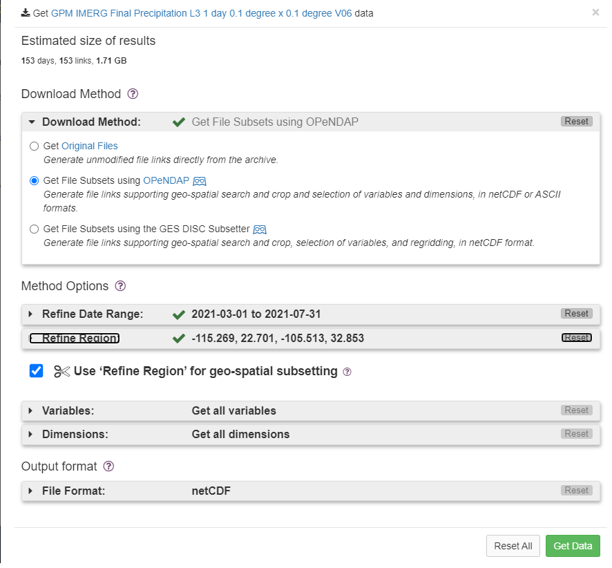

# Proceso para obtener los datos crudos (Raw Data)
### NASA EARTHDATA
1. Registrarse en [urs.earthdata.nasa.gov](https://urs.earthdata.nasa.gov/)
2. Una vez creada la cuenta vamos al siguiente [enlace](https://disc.gsfc.nasa.gov/datasets/GPM_3IMERGDF_06/summary) para seleccionar los datos 
3. En la opción "Get Data" podemos generar el archivo con los enlaces al conjunto de datos que necesitamos. Nosotros descargaremos desde el 03 de Marzo de 2021 hasta 31 de Julio 2021  



4. Una vez hecho esto, te genera un archivo [subset](https://github.com/danielmc81/ing_caracteristicas/blob/main/subset_GPM_3IMERGDF_06_20211207_183037.txt) con los enlaces para descarga de los datasets de NASA  
5. Ya que tenemos el enlace, abrimos una terminal en linux para descargar por lotes  
6. Generamos en $HOME un archivo llamado .netrc con nuestra llave para earthdata  
  ```echo "machine urs.earthdata.nasa.gov login user password passwd" >> $HOME/.netrc```  
  user y passwd son las que usaste para registrarte anteriormente  
7. Descargamos todos los datos con wget  
  ```wget --load-cookies .urs_cookies --save-cookies .urs_cookies --auth-no-challenge=on --keep-session-cookies --content-disposition -i subset_GPM_3IMERGDF_06_20211207_183037.txt```  
8. Esta parte tarda algunos minutos, todo depende de la cantidad de datos que busques descargar.

### PROMETEUS
  Los datos de pronóstico de prometeus no estan disponibles públicamente, para conseguirlos es necesario escribirle al responsable del proyecto Dr. Carlos Minjares. La información completa esta en la página oficial [PROMETEUS](prometeus.unison.mx).  
  La información que nos proporcionaron esta en formato csv el cual contiene el pronóstico a 84 horas de distintas ciudades de los estados de Sonora, Sinaloa y Chihuahua y contiene datos de distintas variable meteorológicas. 
  
